# Android-Studio-Study
study Android Studio with Kotlin
=====================================================
#1. Simple Notepad 
--------------------------------------
Notepad with save function only (save as SimpleNote.txt in \0\SimpleNotepad)  

#2. Simple DFS BFS Simulator  
--------------------------------------
Execute DFS or BFS at adjacency matrix and fill with '1'.  
You can save graph data and load data.(\0\DFSBFSSimulator\GraphData.txt)  
(input form: 0=can go, 2= start point, other character= can't go)  
  
If input graph data is one line, you must put '\n'(it means just Enter) to end of the line.  
(Maybe fix it later?)  

~~TODO: add delay between step and step to show progression of BFS or DFS~~  
~~(Maybe use Coroutine?)~~
  
Modify 'Simple DFS BFS Simulator' to show dfs and bfs step by step.  
Implemented with Thread and Handler  

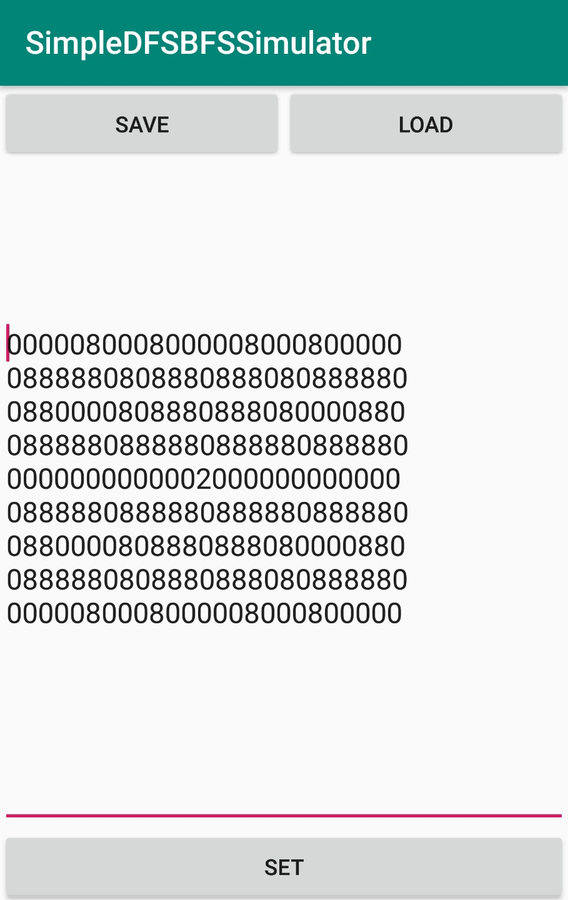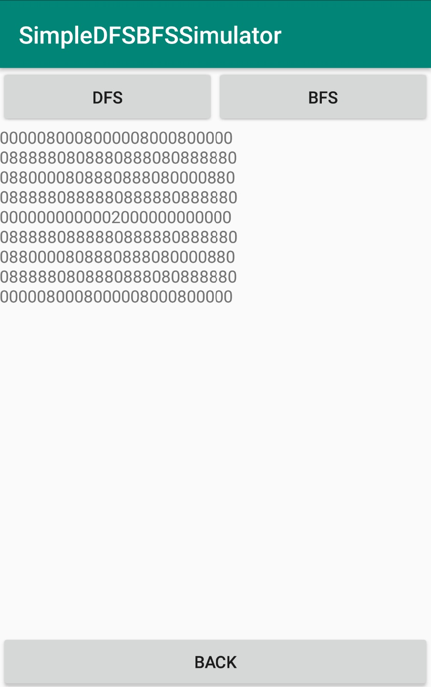  

Execute DFS and BFS  

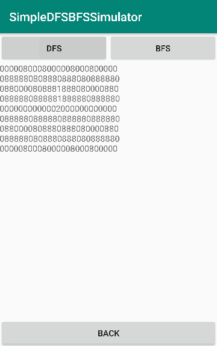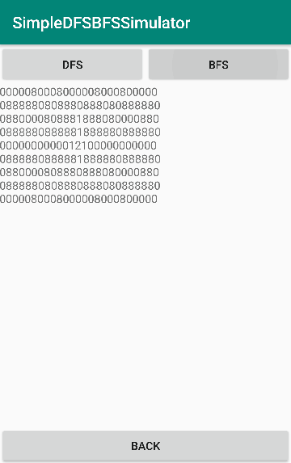  

#3. Data Binding Study
--------------------------------------
Implement data binding in 2 ways.  
If you enter a string in 'TextEditor', 'TextField' is updated  in real time
Buttons don't have any functions.  

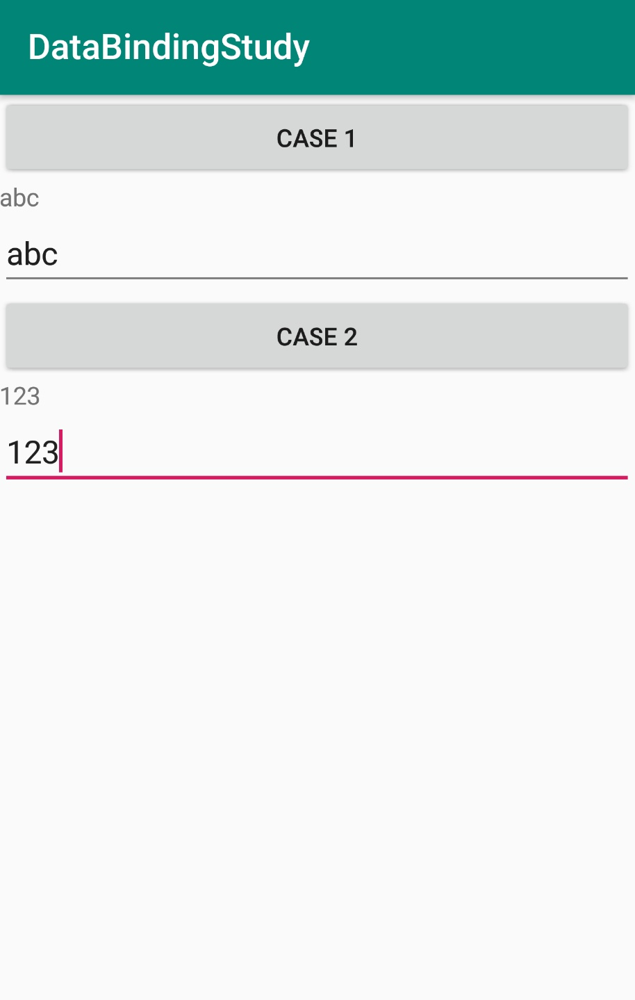

#4. Simple Timer
--------------------------------------
Implemented with Thread and Handler  

START: Start timer  
STOP: Stop timer  
LAP: Record current time in a TextView  
RESET: Reset All   

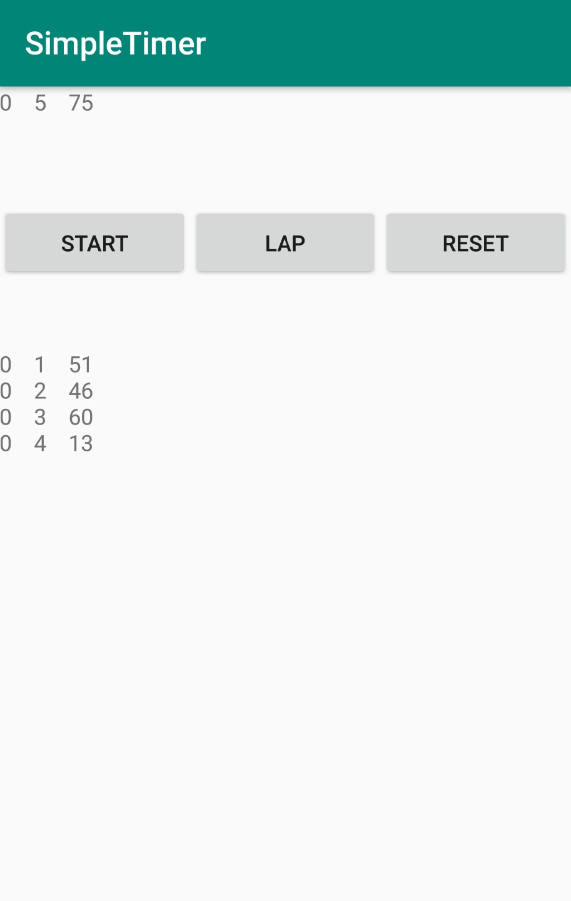

#5. Simple Login Form
---------------------------------------  
After registing your account, you can log in to your account.  
Account data will save as AccountData.txt in \0\SimpleLogin  

~~TODO: encrypt AccountData~~  
Encrypt AccountData by "javax.crypto.Cipher" class  

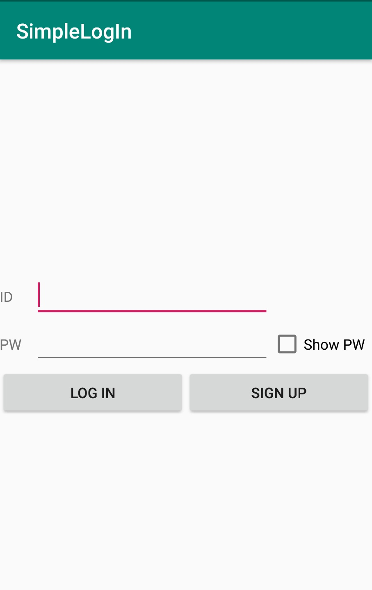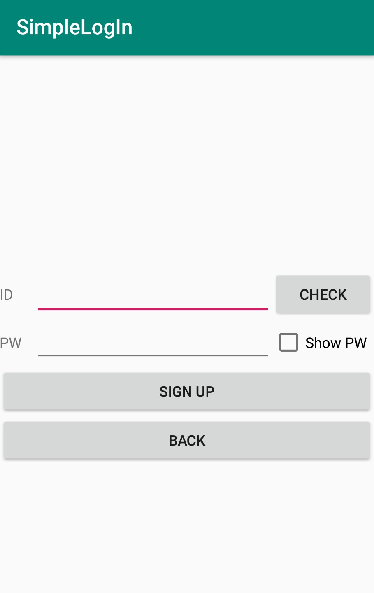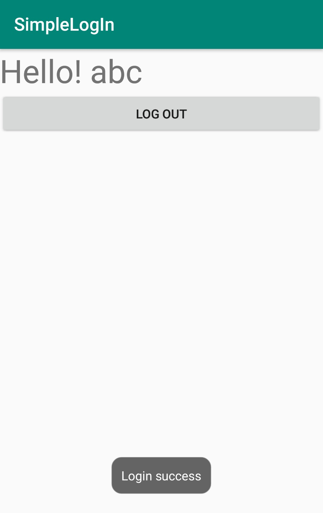  

Encrypted Data  

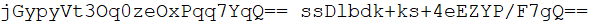

#6. Simple Number Converter
---------------------------------------  
Implemented with TextChangedListener.  
First, choose radix that you want to write.   
When you write number, it converts number (Binary<->Decimal<->Hexadecimal) instantly.  
If you write wrong number, it displays "Invalid Data".   

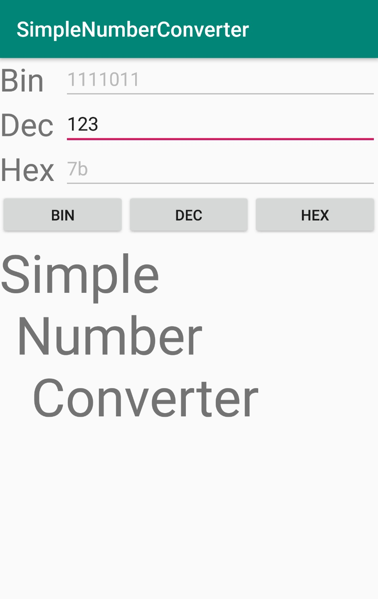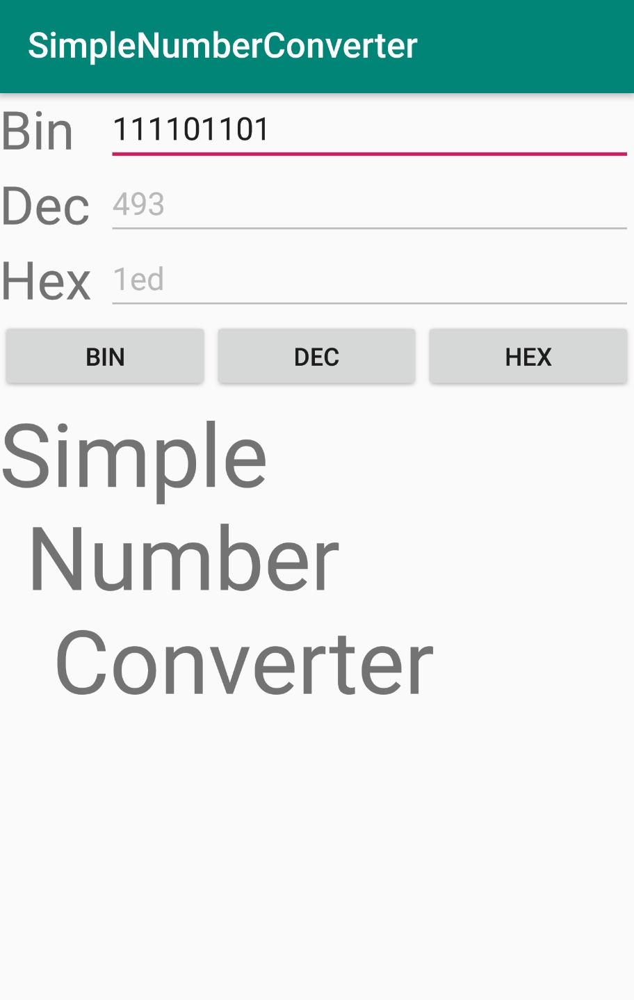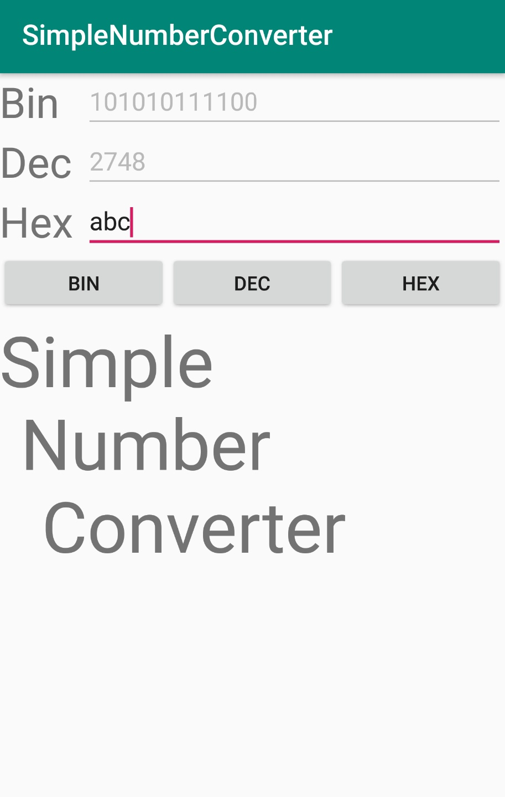

#7. TabLayout
---------------------------------------
Implement Tab UI using Tablayout and ViewPager  

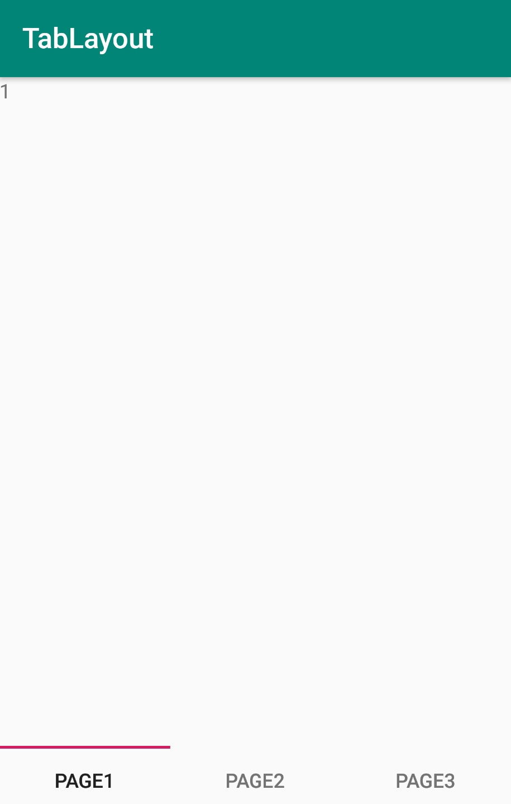

#8. SimpleSearchForm
----------------------------------------
Not finished yet
